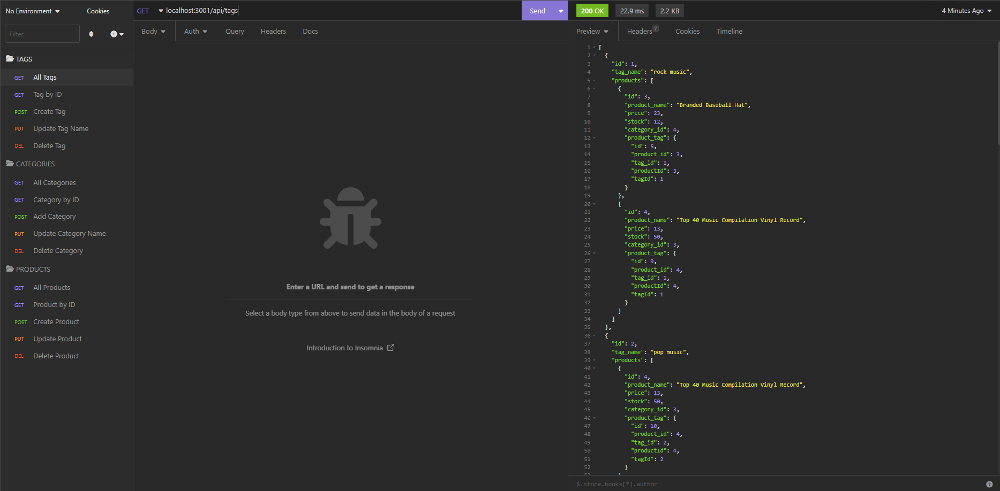
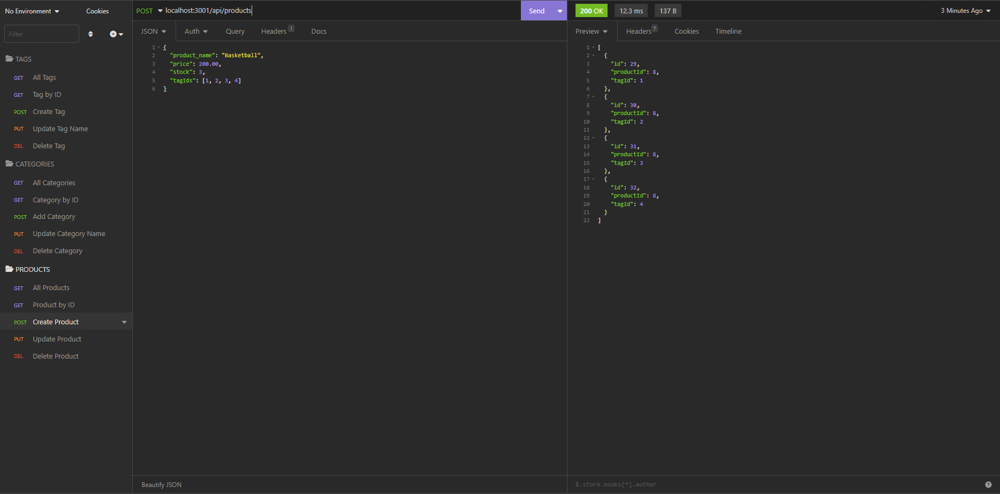

# E-commerce Back End Starter Code

## Description

The following challenge involved creating the backend for an e-commerce site. The challenge involved working with Sequelize to interact with a MYSQL database. The models and routes were created to complete the back end. The following API calls include:

-	GET a full list of products, categories, or tags
-	GET a specific product, category, or tag by ID
-	POST a new product, category, or tag
-	PUT a new product, category, or tag
-	DELETE a product, category, or tag

Link to Video of Application: https://www.loom.com/share/25863544fcc34613924edd89a5c517fd

## Installation

Please install libraries and run on a console. Prior to starting the application, please open your local SQL server and run "schema.sql".

The password for your local server should be entered in the .env.EXAMPLE file. Please rename the file to .env once completed.

Run the command line node ./seeds/index.js to seed the database.

Run server (npm start) and use Insomnia to test API calls.

## Technologies Used

- Node.js
- Sequelize
- Express
- Dotenv

## License

none